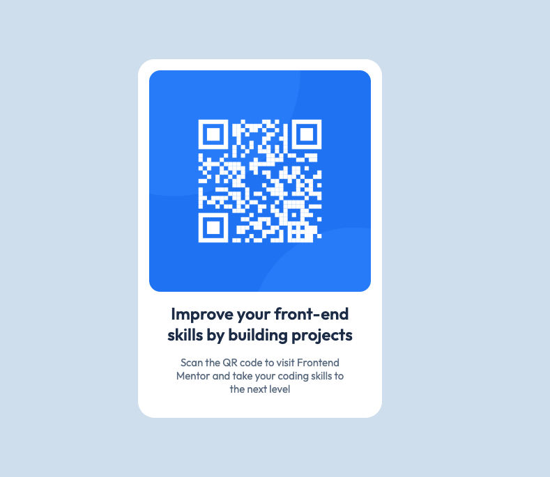

# 🚀 A simple, modern esthetic QR code component using HTML & CSS.

## 🛠️ Built with

- Semantic HTML5 markup
- CSS custom properties
- CSS Flexbox

### 📚 What I learned

In this section, I learned :

- How to structure an HTML document semantically using elements like '<article>'
- How to use CSS Flexbox for centering and arranging elements vertically and horizontally.
- How to use relative units like 'rem' for padding and border-radius to improve scalability and accessibility.

## 👨🏻‍💻 Author

- Hideur Samy ([@Seppxku](https://github.com/Seppxku))
